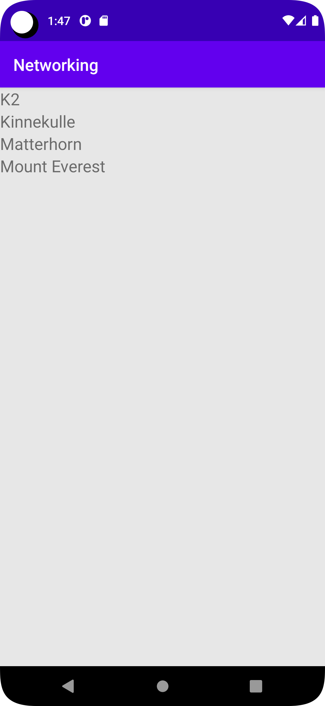

# Rapport

**A "MainActivity" class was created to initiate an AsyncTask for downloading JSON data from a specified URL.
Once the data is downloaded, it is parsed using the Google Gson library and stored in a list of "Mountain" objects.
The list is then converted into a list of "RecyclerViewItem" objects and displayed in a RecyclerView using an adapte.

Additionally, a "Mountain" class was created to represent the data retrieved from the JSON API.
The class has a constructor that initializes these fields, as well as getters and setters for the "ID" and "name" fields.

Furthermore, a "RecyclerViewAdapter" class has been created that extends the "RecyclerView.Adapter" class to display "RecyclerViewItem" objects in a RecyclerView.
The class has a custom "ViewHolder" class that contains a "TextView" to display the title of the "RecyclerViewItem" object.**


## Följande grundsyn gäller dugga-svar:


```
public class MainActivity extends AppCompatActivity implements JsonTask.JsonTaskListener {
    private final String JSON_URL = "https://mobprog.webug.se/json-api?login=brom";
    private final String JSON_FILE = "mountains.json";
    private ArrayList<Mountain> listOfMountains;
    private RecyclerViewAdapter adapter;
    private RecyclerView view;
    @Override
    protected void onCreate(Bundle savedInstanceState) {
        super.onCreate(savedInstanceState);
        setContentView(R.layout.activity_main);
        new JsonTask(this).execute(JSON_URL);
        view = findViewById(R.id.recycler_view);
        listOfMountains = new ArrayList<>();
        adapter = new RecyclerViewAdapter(listOfMountains);
        view.setAdapter(adapter);

       /* ArrayList<RecyclerViewItem> items = new ArrayList<>(Arrays.asList(
                new RecyclerViewItem("Matterhorn"),
                new RecyclerViewItem("Mont Blanc"),
                new RecyclerViewItem("Denali")
        ));*/
        view.setLayoutManager(new LinearLayoutManager(this));

        // new JsonFile(this, this).execute(JSON_FILE);

    }
    @Override
    public void onPostExecute(String json) {
        Log.d("MainActivity", json);
        Gson gson = new Gson();
        Type type = new TypeToken<List<Mountain>>() {}.getType();
        ArrayList<Mountain> list = gson.fromJson(json, type);
        listOfMountains.addAll(list);
        Log.d("Abdu",String.valueOf(listOfMountains.size()));
        adapter.addNewMountains(listOfMountains);
        adapter.notifyDataSetChanged();
    }
}
```


```
class RecyclerViewAdapter extends RecyclerView.Adapter<RecyclerViewAdapter.ViewHolder> {
private List<Mountain> listOfMountains;
public RecyclerViewAdapter(List<Mountain> listOfMountains) {
this.listOfMountains = listOfMountains;
}


    public  void addNewMountains(List<Mountain> listOfMountains){
        this.listOfMountains = listOfMountains;
    }


    @Override
    @NonNull
    public ViewHolder onCreateViewHolder(@NonNull ViewGroup parent, int viewType) {
        View view = LayoutInflater.from(parent.getContext()).inflate(R.layout.recyclerview_item, parent, false);
        return new ViewHolder(view);
    }

    @Override
    public void onBindViewHolder(@NonNull ViewHolder holder, int position) {
        Log.d("Abdu", "Tomten");
        Log.d("Abdu", String.valueOf(listOfMountains.size())+ " " + String.valueOf(position));
        holder.title.setText(listOfMountains.get(position).getName());
    }

    @Override
    public int getItemCount() {
        return listOfMountains.size();
    }

    public class ViewHolder extends RecyclerView.ViewHolder  {
        TextView title;

        ViewHolder(View itemView) {
            super(itemView);
            title = itemView.findViewById(R.id.name);
        }


    }
```


```
public class RecyclerViewItem {

    private String name;
    private RecyclerViewItem adapter;

    public RecyclerViewItem(String title) {
        this.name = name;
    }

    public String getTitle() {
        return title;
    }
```

```
public class Mountain {
    private String ID;
    private String name;

    public Mountain(String ID, String Name) {
        this.ID = ID;
        this.name = Name;
    }


    public String getID() {

        return ID;
    }

    public void setID(String ID) {

        this.ID = ID;
    }

    public String getName() {

        return name;
    }

    public void setName(String name) {

        this.name = name;
    }
}
```

```
public class JsonFile {

    private final JsonTask.JsonTaskListener listener;
    private final Activity activity;

    public JsonFile(Activity activity, JsonTask.JsonTaskListener listener) {
        this.activity = activity;
        this.listener = listener;
    }

    public void execute(String file) {
        try (InputStream stream = activity.getAssets().open(file)) {
            Scanner scanner = new Scanner(stream).useDelimiter("\\A");
            listener.onPostExecute(scanner.hasNext() ? scanner.next() : "");
        } catch (IOException exception) {
            Log.d("JsonFile", exception.getMessage());
        }
    }

}
```

```
public class
JsonTask extends AsyncTask<String, String, String> {

    public interface JsonTaskListener {
        void onPostExecute(String json);
    }

    private HttpURLConnection connection = null;
    private BufferedReader reader = null;
    private final JsonTaskListener listener;

    @SuppressWarnings("deprecation")
    public JsonTask(JsonTaskListener listener) {
        this.listener = listener;
    }

    protected String doInBackground(String... params) {
        try {
            URL url = new URL(params[0]);
            connection = (HttpURLConnection) url.openConnection();
            connection.connect();

            InputStream stream = connection.getInputStream();
            reader = new BufferedReader(new InputStreamReader(stream));

            StringBuilder builder = new StringBuilder();
            String line;
            while ((line = reader.readLine()) != null && !isCancelled()) {
                builder.append(line).append("\n");
            }
            return builder.toString();
        } catch (MalformedURLException e) {
            e.printStackTrace();
        } catch (IOException e) {
            e.printStackTrace();
        } finally {
            if (connection != null) {
                connection.disconnect();
            }
            try {
                if (reader != null) {
                    reader.close();
                }
            } catch (IOException e) {
                e.printStackTrace();
            }
        }
        return null;
    }

    @Override
    protected void onPostExecute(String json) {
        listener.onPostExecute(json);
    }
}
```

Bilder läggs i samma mapp som markdown-filen.



Läs gärna:

- Boulos, M.N.K., Warren, J., Gong, J. & Yue, P. (2010) Web GIS in practice VIII: HTML5 and the canvas element for interactive online mapping. International journal of health geographics 9, 14. Shin, Y. &
- Wunsche, B.C. (2013) A smartphone-based golf simulation exercise game for supporting arthritis patients. 2013 28th International Conference of Image and Vision Computing New Zealand (IVCNZ), IEEE, pp. 459–464.
- Wohlin, C., Runeson, P., Höst, M., Ohlsson, M.C., Regnell, B., Wesslén, A. (2012) Experimentation in Software Engineering, Berlin, Heidelberg: Springer Berlin Heidelberg.
